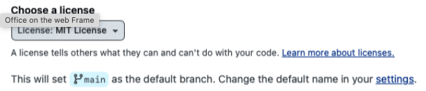
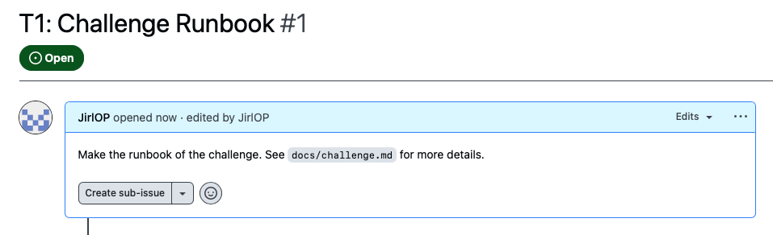

# Runbook for Challenge

## Summary

You will learn how to set up a secure repository on GitHub with the best practices in naming convetions, branch protection, simple git commands to work local/remote and README documentation.

## Objective

Apply the best practices for GitHub repositories by creating a well-structured and documented repository. Submit your repository URL for feedback and experience the process of receiving feedback via GitHub Issues and Pull Requests.

## Task Requirements

## Procedure

1. Create a new repo with the MIT License and a README file.



2. Create a repo with best practice convention. For example, this repo is named `git-practice`.

3. Protect the main repo branch on this path: `Settings > Branches > Add branch ruleset`. Example of base settings to add below.


- Adittionaly you can add `Block force push` and `Restrict who can push to matching branches` to protect the main branch.

- Then push create bottom to save the settings.

4. Add an Issue in GitHub for the next task to complete.

- Example of an issue on this repo:



5. Clone your new repo to your local machine using Git and set up your development environment.

```bash
git clone https://github.com/JirlOP/git-practice.git
cd git-practice
```

6. Create a new feature branch with convention `feature/add-functionality`. The convention for this repo is `feature/ticket/functionality`.
- Example of a feature branch:

```bash
git checkout -b feature/T1/challenge-runbook
```

7. Make the the README file with the following sections:

- **Project Title and Description**: Briefly describe the repository’s purpose.
- **Getting Started**: Provide setup instructions, including prerequisites and installation steps.
- **Usage Examples**: Add examples of how to use the repository, including code snippets.
- **Features**: Highlight key functionalities and features of the project.
- **Contributing**: Add contribution guidelines, including how to clone the repository, create branches, and submit pull requests.
- **License**: Specify the repository’s license, e.g., MIT License.

**Note**: see repo main README for an example of a README file.

8. Make meaningful commits with clear, descriptive messages.

For example this file was commited as:
```bash
git add .
git commit -m "Add: Runbook for challenge"
git push origin feature/T1/challenge-runbook
```
