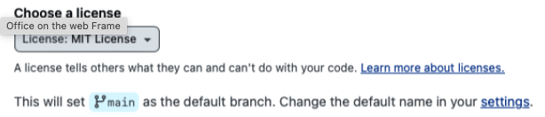
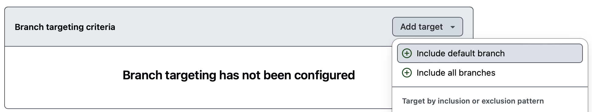
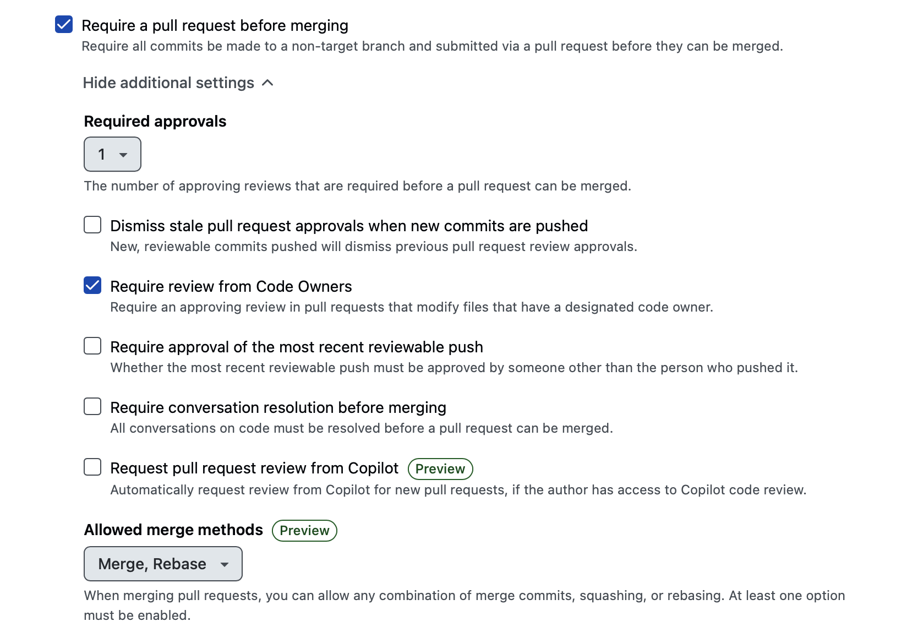
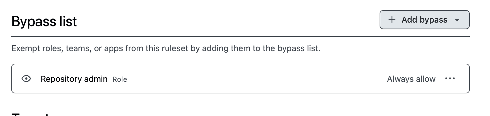
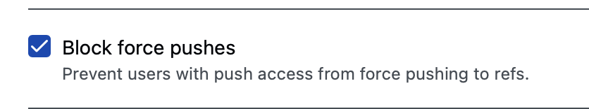
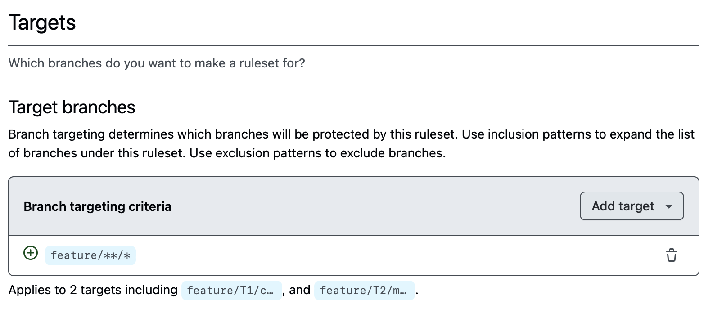
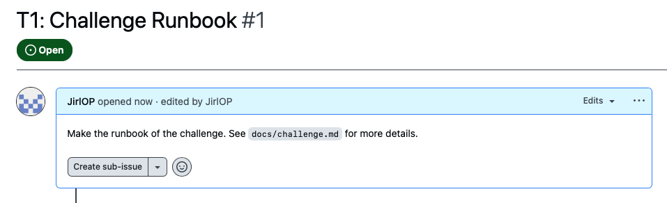
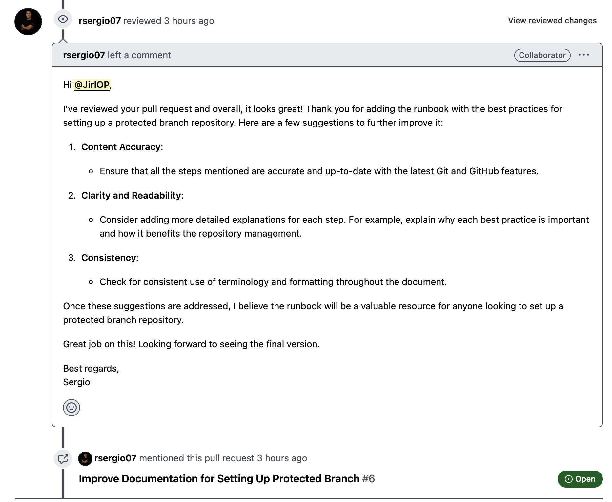
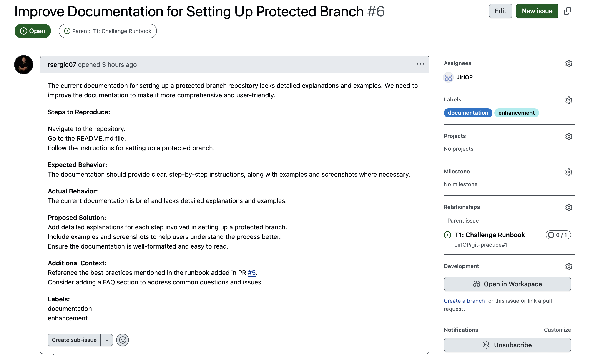
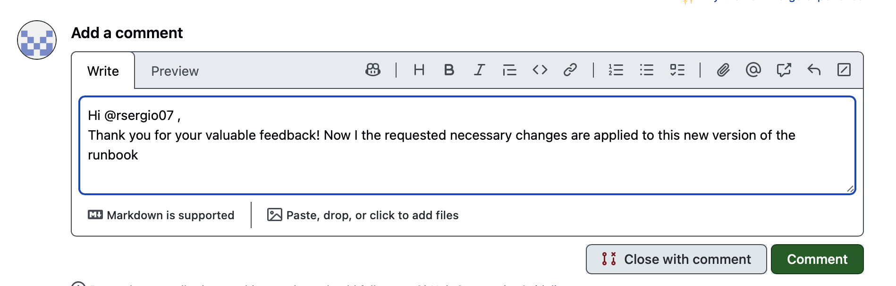

# Runbook for Challenge: Secure Repository

## Summary

You will learn how to set up a secure repository on GitHub with the best practices like naming conventions, branch protection, set a license, simple git commands to work local/remote and README documentation.

## Objective

Apply the best practices for GitHub repositories by creating a well-structured and documented repository. Submit your repository URL for feedback and experience the process of receiving feedback via GitHub Issues and Pull Requests.

## Task Requirements

## Procedure

### Initial Setup

1. Create a new repo with the `MIT License` and a `README` file selected.

    

2. Create a repo with best practice convention. For example, this repo is named `git-practice`. The convention follow `kebab-case` and the name should be descriptive.

### Branch Strategy

1. Protect the `main` repo branch on this path: `Settings > Branches > Add branch ruleset`. Example of base settings to add below.

    - Select `Add Target` option to add `default branch` as a target of this rule.
    

    - The basic Rules for branch protection are the following:
    

    **Parameters explained:**
    - **Required approvals** will be the number of approvals required to merge a PR. This is set to 1 by default.
    - **Restrict who can push to matching branches** will allow only the user to push to the main branch.
    - **Allowed merge methods** will allow only the designated forms of merge.

    **Additional settings:**
    - **Repo Owners** that will want to PR into main branch you can add the role of `Admin` to the `Bypass list`, this allows to `Admin` role to approve the PRs created by them. *This is not a good practice*!
    

    - **Block force push** will prevent users from force pushing to the main branch.
    

    **Note**: Other settings are default.

2. Then **push create bottom** bellow to save the settings. You will see something like this:

3. Create a protection for other branches.
    
    This will match the pattern `feature/**/*` that only match branches with two levels of depth. This is a good practice to protect the branches that are not the main branch.
    For example, the branch `feature/T1/challenge-runbook` will be protected by this rule.

### Development Workflow

1. Add an Issue in GitHub for the next task to complete.

   - Example of an issue on this repo:
    

2. Clone your new repo to your local machine using Git and set up your development environment.

    ```bash
    git clone https://github.com/JirlOP/git-practice.git
    cd git-practice
    ```

3. Create a new feature branch with convention `feature/add-functionality`. The convention for this repo is `feature/ticket/functionality`.

   - Example of a feature branch:

    ```bash
    git checkout -b feature/T1/challenge-runbook
    ```

4. Make the the README file with the following sections:

   - **Project Title and Description**: Briefly describe the repository’s purpose.
   - **List of Contents**: Include a table of contents with links to each section.
   - **Getting Started**: Provide setup instructions, including prerequisites and installation steps.
   - **Usage Examples**: Add examples of how to use the repository, including code snippets.
   - **Features**: Highlight key functionalities and features of the project.
   - **Contributing**: Add contribution guidelines, including how to clone the repository, create branches, and submit pull requests.
   - **License**: Specify the repository’s license, e.g., MIT License.

   **Note**: see the [README.md](../README.md) file for an example.

5. Make meaningful commits with clear, descriptive messages.

    For example this file was committed as:

    ```bash
    git add .
    git commit -m "Add: Runbook for challenge"
    git push origin feature/T1/challenge-runbook
    ```

6. Create a `Pull Request` in `GitHub` to merge your feature branch into the `main` branch. `GitHub` automatically put a suggestion to make the PR.

7. Collaborate with your team to review and approve the PR. 

    In this example other collaborator **request changes to the PR**. As we see here:
    

    A good practice is **create an Issue to track the changes requested**, and make a reference to the PR. See the next configuration:
    

8. Make the changes and keep pushing at the same branch, to then **request a review again**.

    A good practice is letting a comment when you are ready for review. For example:
    
    